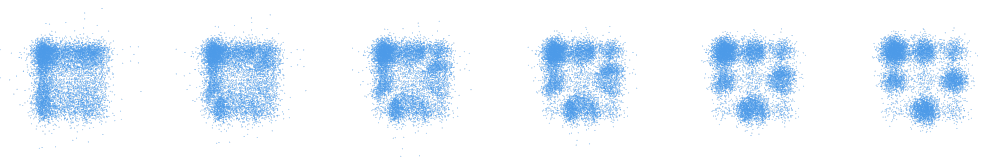

# Adapting Noise to Data: Generative Flows from 1D Processes

Implementation accompanying the paper [*Adapting Noise to Data: Generative Flows from 1D Processes*](https://arxiv.org/abs/2510.12636). The code provides flow-matching baselines and quantile-enhanced models for 2‑D toy targets and image datasets (MNIST, CIFAR‑10).



## Installation

Create and activate a virtual environment (recommended):

```bash
python -m venv learn-noise
source learn-noise/bin/activate
```

Install dependencies:

```bash
pip install -r requirements.txt
```

Ensure PyTorch is installed according to your system's CUDA version if GPU support is needed.

## Running Experiments

### 2‑D Targets
```bash
python -m learn_noise.cli_2d --config default
python -m learn_noise.cli_2d --config funnel
```

### Image Datasets
```bash
python -m learn_noise.cli_images --config mnist
python -m learn_noise.cli_images --config cifar10
```

### Common Flags
- `--baseline`: train the flow-matching baseline only.
- `--baseline-flow {linear,mmd,kac}`: select the baseline dynamics. Additional knobs (`--baseline-mmd-b`, `--baseline-kac-a`, `--baseline-kac-c`, …) control each flow.
- `--pretrain`: run quantile pretraining before joint optimisation.
- `--override key=value`: override any YAML config entry.
- `--no-wandb`: disable Weights & Biases logging (disabled in configs by default).

## Baseline Flow Summary

| Flow   | Description                               | Key Parameters                     |
|--------|-------------------------------------------|------------------------------------|
| linear | Linear interpolation between latent & data| `baseline_latent`                  |
| mmd    | MMD-inspired analytic flow                | `baseline_mmd_b`                   |
| kac    | Kac process with light-cone constraint     | `baseline_kac_a`, `baseline_kac_c` |

Default hyper-parameters are defined in the YAML configs under `learn_noise/configs/`.


## Project Structure

```
Learn-Noise/
├── learn_noise/                      # Python package with training and evaluation code
│   ├── cli.py                        # Entry point selecting between task-specific CLIs
│   ├── cli_2d.py                     # CLI for 2-D toy target experiments
│   ├── cli_images.py                 # CLI for image experiments (MNIST, CIFAR-10)
│   ├── configs/                      # YAML configuration files
│   │   ├── 2d/                       # Configs for 2-D targets
│   │   └── images/                   # Configs for image datasets
│   ├── networks/                     # Flow-matching architectures and wrappers
│   │   ├── model_wrapper.py          # Model orchestration utilities
│   │   └── unet_oai.py               # U-Net backbone used for images
│   ├── training/                     # Training loops, optimisers, logging helpers
│   │   ├── train_fm_baseline.py      # Flow-matching baseline trainer
│   │   ├── train_fm_quantile.py      # Quantile-enhanced trainer
│   │   └── quantile_losses.py        # Quantile-specific loss functions
│   ├── utils/                        # Plotting, evaluation, and sampling utilities
│   │   ├── evaluation.py             # Metric computation helpers
│   │   └── sampler.py                # Samplers for flow models
│   └── eval/                         # Additional evaluation scripts
│       └── run_fid.py                # FID evaluation driver
├── data/                             # Local datasets and generated samples (gitignored)
├── requirements.txt                  # Python dependencies
└── README.md                         # Project documentation
```

## Code Contributions

This toolbox has been created and is maintained by
- [Jannis Chemseddine](mailto:chemseddine@math.tu-berlin.de)
- [Gregor Kornhardt](mailto:kornhardt@math.tu-berlin.de)

Suggestions for improvements are always welcome!

## Citation

If you use this repository in your research, please cite the accompanying paper:

```
@misc{CKDS2025,
  title         = {Adapting Noise to Data: Generative Flows from 1D Processes},
  author        = {Jannis Chemseddine and Gregor Kornhardt and Richard Duong and Gabriele Steidl},
  year          = {2025},
  eprint        = {2510.12636},
  archivePrefix = {arXiv},
  primaryClass  = {stat.ML},
}
```
